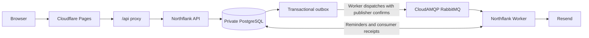

# Schedlane

[](https://github.com/MhmdRayanm7/schedlane/actions/workflows/ci.yml)

Schedlane is a multi-organization appointment scheduling application. Its V1 covers organization onboarding and publication, configurable services and resources, availability, public and manual booking, guest self-service, team access, reminders, scoped booking links, and platform administration.

**[Live app](https://schedlane.pages.dev)** · **[Public booking demo](https://schedlane.pages.dev/book/demo-barbers)**

The portfolio demo, Schedlane Demo Barbers, includes three priced services, two barbers, and weekly hours in Asia/Jerusalem. Admin credentials are private and are not provided as public demo access. Demo appointments are illustrative; no real barber appointment is arranged.

## V1 capabilities

- Organization request, approval, publication, pause, suspension, and lifecycle workflows
- Services, resources, assignments, weekly schedules, overrides, and time blocks
- Public booking and secure guest contact/cancellation management
- Manual booking, day/week views, rescheduling, cancellation, and no-show lifecycle
- Owner, Manager, Staff, and Platform Admin authorization
- Transactional confirmation, lifecycle, and 24-hour reminder emails
- Revocable Service, Resource, and combined shareable booking links

## Architecture

The monorepo uses React and Vite for the Web application, Fastify and TypeScript for the API, PostgreSQL with Kysely for persistence, Better Auth for authentication, and RabbitMQ with a transactional outbox for reliable background work. A separate Worker dispatches outbox events, schedules reminders, and sends transactional email through Resend or a development console provider.

The code follows a functional-core/imperative-shell approach: scheduling calculations are kept deterministic while HTTP, database transactions, locks, queues, and email remain explicit.



```text
apps/api       Fastify API, domain/application modules, migrations, fixtures
apps/web       React/Vite application
apps/worker    RabbitMQ consumers, outbox dispatcher, reminders, email
scripts        Local reset and fixture-information commands
```

## Engineering highlights

- PostgreSQL exclusion constraints prevent concurrent confirmed bookings from overlapping. Occupancy includes the service and its buffer and uses half-open `[start, occupiedUntil)` ranges, so adjacent bookings remain valid.
- Strict local calendar dates and Asia/Jerusalem scheduling keep date boundaries and daylight-saving transitions separate from UTC storage.
- Booking snapshots preserve duration, buffer, price, and cancellation policy when service configuration changes.
- Booking writes and their outbox events commit in one transaction. The Worker publishes persistent RabbitMQ messages with broker confirms before marking events dispatched.
- At-least-once delivery uses bounded retries, dead-letter queues, database consumer receipts, advisory locks, and provider idempotency keys. Delivery is not claimed to be exactly once.
- Guest management capabilities use random 256-bit tokens, SHA-256 lookup hashes, and AES-256-GCM encryption for later email delivery.
- Explicit tenant filters, composite foreign keys, verified-user checks, and role authorization protect organization data and preserve anti-leak lookup ordering.
- GitHub Actions checks formatting/lint, forced typechecking, Docker-backed integration tests, and production builds on main and pull requests.

## Tech stack

TypeScript, Node.js 24, React, Vite, Tailwind CSS, Fastify, Better Auth, PostgreSQL 18, Kysely, RabbitMQ, Resend, Vitest, Testcontainers, Biome, pnpm, and Turborepo.

## Screenshots

Live demo views captured for V1:

| Admin bookings · Light | Admin bookings · Dark |
| --- | --- |
|  |  |

| Public booking | Services | Platform Admin |
| --- | --- | --- |
|  |  |  |

## Prerequisites

- Node.js 24
- pnpm 11.24.0 (declared in `packageManager`)
- Docker Desktop or another Docker Engine with Compose

Corepack can activate the repository's pnpm version:

```sh
corepack enable
corepack install
```

## Local setup

1. Clone the repository and install the locked dependencies.

   ```sh
   pnpm install --frozen-lockfile
   ```

2. Create local environment files from the committed examples.

   PowerShell:

   ```powershell
   Copy-Item apps/api/.env.example apps/api/.env
   Copy-Item apps/web/.env.example apps/web/.env
   Copy-Item apps/worker/.env.example apps/worker/.env
   ```

   macOS/Linux:

   ```sh
   cp apps/api/.env.example apps/api/.env
   cp apps/web/.env.example apps/web/.env
   cp apps/worker/.env.example apps/worker/.env
   ```

3. Generate development secrets and replace the corresponding placeholders in both API and Worker environment files.

   ```sh
   node -e "console.log(require('node:crypto').randomBytes(32).toString('hex'))"
   node -e "console.log(require('node:crypto').randomBytes(32).toString('base64'))"
   ```

   Use the hex value for `BETTER_AUTH_SECRET`. Use the same base64 value for `GUEST_MANAGEMENT_TOKEN_ENCRYPTION_KEY` in the API and Worker.

4. Start Docker, recreate clean local infrastructure, run every migration, and load deterministic fixtures.

   ```sh
   pnpm dev:reset
   ```

5. Start the API, Web application, and Worker.

   ```sh
   pnpm dev
   ```

6. In another terminal, print the current fixture users, roles, organization states, URLs, and generated guest-management links.

   ```sh
   pnpm dev:info
   ```

The default Web URL is `http://localhost:5173`; the API listens on `http://localhost:3000`. RabbitMQ management is available at `http://localhost:15672` with the local Compose credentials in `compose.yaml`.

Fixture addresses ending in `@schedlane.test` are local test identities, not real inboxes. Development verification and transactional emails are printed by the console providers.

## Validation and useful commands

```sh
pnpm check:fix                         # safe formatting/lint fixes
pnpm check                             # Biome validation
pnpm exec turbo typecheck --force      # TypeScript across the monorepo
pnpm test                              # unit and Docker-backed integration tests
pnpm build                             # production builds
pnpm dev:reset                         # destructive local-only DB/queue reset and fixture seed
pnpm dev:info                          # current deterministic QA matrix
pnpm --filter @schedlane/api db:migrate
```

API and Worker integration tests use Testcontainers and therefore require a running Docker daemon. `dev:reset` is deliberately guarded to a local `schedlane` database and `NODE_ENV=development`.

## Production configuration

Production fails closed unless both API and Worker use `EMAIL_PROVIDER=resend`. Resend credentials and a sender are required. The Worker additionally requires a base64-encoded 32-byte `GUEST_MANAGEMENT_TOKEN_ENCRYPTION_KEY` plus valid `APP_BASE_URL` and `GUEST_BOOKING_MANAGEMENT_URL` HTTP(S) URLs. The API requires valid `BETTER_AUTH_URL` and `WEB_ORIGIN` values and keeps CORS scoped to `WEB_ORIGIN`.

Apply all database migrations before starting a new release. The existing liveness and readiness endpoints are:

- `GET /health/live`
- `GET /health/ready` (includes PostgreSQL connectivity)

## Deployment

The live Web app runs on Cloudflare Pages. Its `/api/*` proxy forwards requests to the Northflank API while keeping authentication cookies on the Pages origin. Northflank runs a separate API and Worker with private PostgreSQL; CloudAMQP provides RabbitMQ, and Resend delivers transactional email. API startup applies migrations before serving requests. CI is defined in [`.github/workflows/ci.yml`](.github/workflows/ci.yml).

See [deployment configuration](docs/deployment.md) and [the release checklist](docs/RELEASE_CHECKLIST.md).

## V1 limitations

- No payments or customer accounts; customers book as guests.
- No custom domain; the live app uses its Cloudflare Pages address.
- Free-tier hosting has provider resource and request limits.
- The Resend test sender restricts delivery to the verified account recipient. Public visitors can explore and book in the demo, but emails to other recipients cannot be delivered until a sender domain is verified.
- Scheduling uses Asia/Jerusalem and Israeli guest phone validation in V1.
