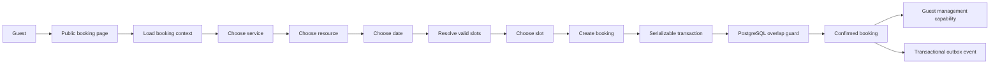
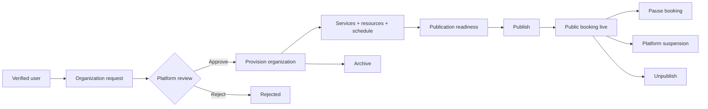
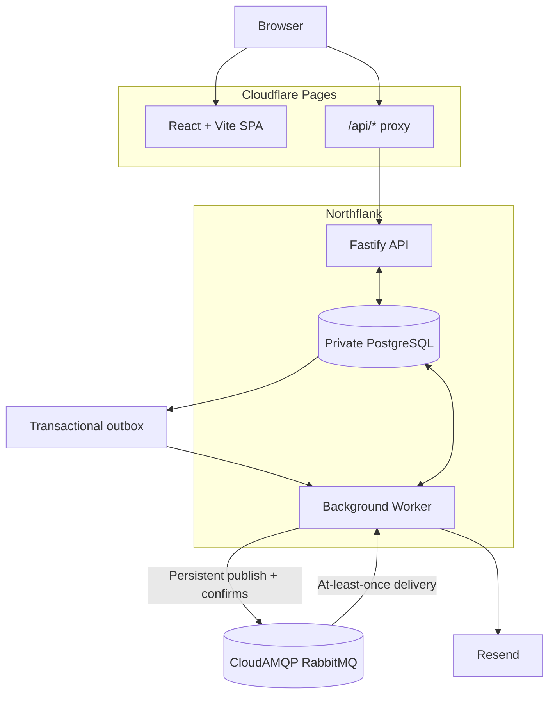
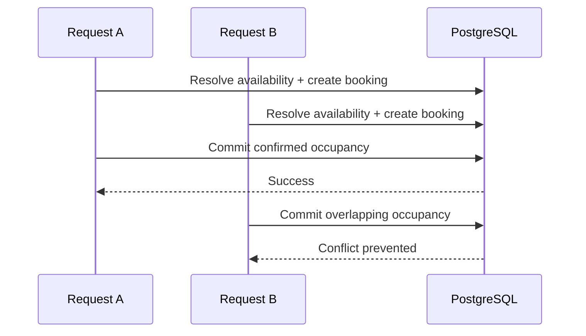
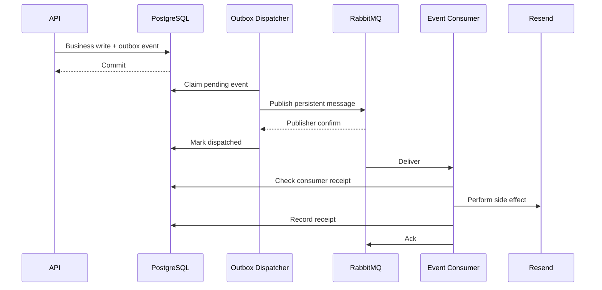
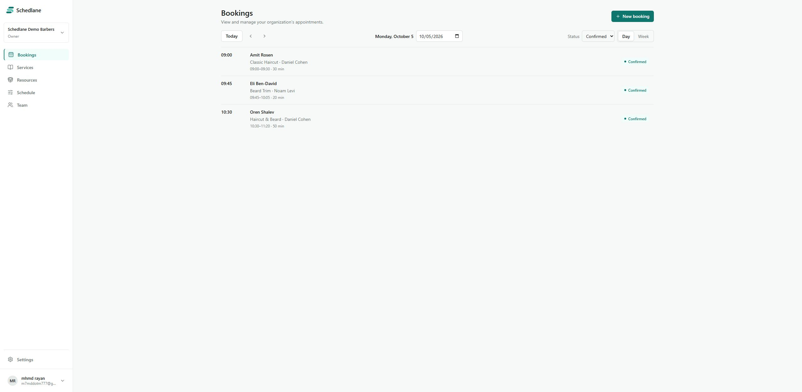
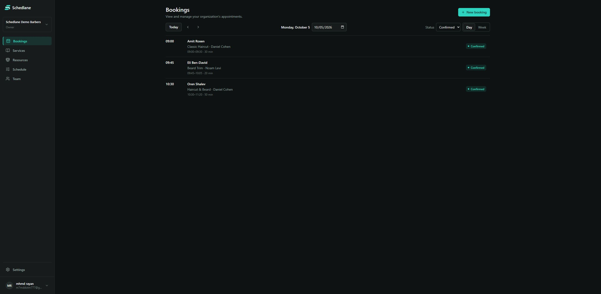
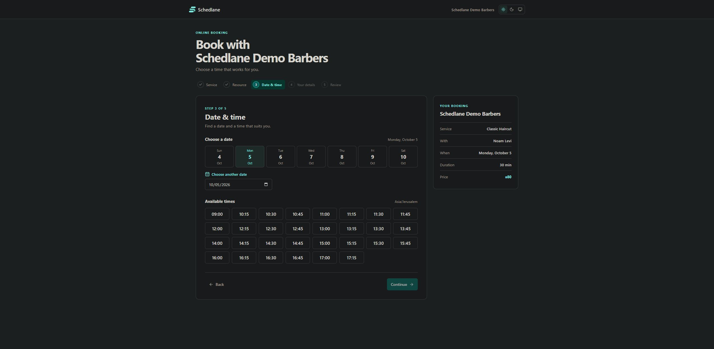
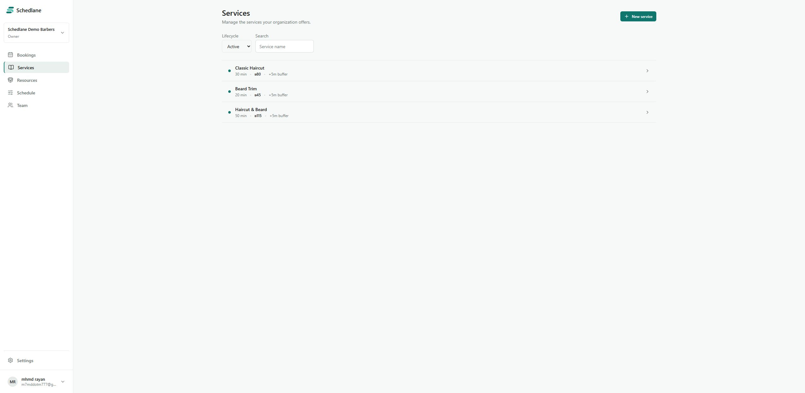
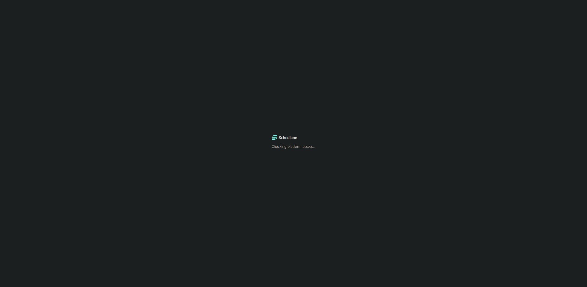

<div align="center">

# Schedlane

### Multi-organization appointment scheduling, built for correctness under real booking constraints.

[](https://github.com/MhmdRayanm7/schedlane/actions/workflows/ci.yml)
[](https://github.com/MhmdRayanm7/schedlane/releases/tag/v1.0.0)


**[Live App](https://schedlane.pages.dev)** ·
**[Public Booking Demo](https://schedlane.pages.dev/book/demo-barbers)** ·
**[v1.0.0 Release](https://github.com/MhmdRayanm7/schedlane/releases/tag/v1.0.0)**

</div>

Schedlane is a full-stack appointment scheduling platform for organizations that manage services, staff/resources, availability, and customer bookings.

The project is intentionally backend-centric. Its main engineering focus is not simply displaying a calendar — it is preserving booking correctness when availability rules, concurrent requests, tenant boundaries, lifecycle changes, background jobs, and external delivery systems all interact.

Schedlane V1 is deployed end to end with a React web application, Fastify API, PostgreSQL persistence, RabbitMQ-based background processing, transactional email, CI, Docker-backed integration tests, and production infrastructure across Cloudflare Pages, Northflank, CloudAMQP, and Resend.

> **Demo**
>
> **Schedlane Demo Barbers** is a public product demo with configured services, resources, pricing, working hours, and live booking availability. Demo appointments are illustrative and admin access remains private.

---

## Why Schedlane

Appointment scheduling looks simple until multiple rules must remain true at the same time:

- customers should only see valid slots;
- a slot must still be valid when the booking is committed;
- two concurrent requests must never create overlapping confirmed bookings;
- service changes must not rewrite historical bookings;
- each organization must remain isolated from every other tenant;
- role permissions must be enforced by the API, not only hidden in the UI;
- booking events and email delivery must survive retries and process failures.

Schedlane was designed around those constraints.

The result is a scheduling system where the database, application layer, and worker processes cooperate to preserve a small set of explicit invariants instead of relying on optimistic UI behavior.

---

## Core capabilities

| Area | Capabilities |
| --- | --- |
| **Organization onboarding** | Verified users can submit organization requests while Platform Admins review, approve, reject, provision, publish, suspend, unpublish, and archive organizations. |
| **Services** | Duration, post-service buffer, activation state, resource assignment, and optional organization-level pricing. |
| **Resources** | Resource creation, activation, service assignment, and linking to eligible organization members. |
| **Availability** | Organization hours, resource hours, date overrides, time blocks, slot intervals, booking horizon, minimum notice, and cancellation cutoff rules. |
| **Public booking** | Service/resource selection, date-based availability resolution, booking creation, and secure guest management. |
| **Scoped booking links** | Revocable links scoped to a Service, Resource, or Service + Resource combination. |
| **Booking operations** | Day/week views, manual booking, rescheduling, cancellation, no-show handling, and supported lifecycle reversals. |
| **Guest self-service** | Capability-based access for viewing a booking, updating contact details, and cancellation within policy. |
| **Team access** | Tenant-scoped Owner, Manager, and Staff authorization with permission-aware resource and booking visibility. |
| **Platform administration** | Organization request review, publication readiness, organization lifecycle management, and platform-level access control. |
| **Transactional email** | Verification, organization workflow, booking lifecycle, and 24-hour reminder email paths. |

---

## Product flow

A slot should not be treated as valid merely because it appeared on screen.

Schedlane resolves availability from current scheduling rules and re-validates booking conditions inside the booking transaction before a confirmed booking is committed.



Availability is derived from:

- organization working hours;
- resource-specific working hours;
- date overrides;
- time blocks;
- service duration;
- post-service buffer;
- slot interval;
- minimum booking notice;
- booking horizon;
- existing occupied ranges;
- organization publication state.

This keeps slot generation and booking correctness inside the same scheduling model.

---

## Organization lifecycle

Schedlane separates organization ownership from platform governance.

Organization teams configure and operate their workspace, while Platform Admins control onboarding and publication lifecycle.



Publication readiness is evaluated from the organization's actual configuration rather than being treated as an isolated UI toggle.

---

## System architecture

Schedlane is a pnpm/Turborepo monorepo with three runtime applications:

- **Web** — React + Vite SPA
- **API** — Fastify + TypeScript application/API
- **Worker** — asynchronous event processing, reminders, and email delivery

The architecture below describes the runtime system rather than mirroring the repository's internal file tree.



Cloudflare Pages is the browser-facing origin and proxies `/api/*` to the API. This keeps authentication cookies first-party while allowing the web application and backend to run on separate providers.

The Worker has no public port, PostgreSQL remains private, and asynchronous work is routed through RabbitMQ.

---

## Booking consistency

The most important invariant in the system is:

> Two confirmed bookings must never occupy the same resource at overlapping times.

Schedlane enforces this at more than one layer.

### 1. Serializable booking transactions

Public and manual booking creation execute inside PostgreSQL `SERIALIZABLE` transactions.

Availability is resolved inside the transaction before the booking write is committed.

### 2. Half-open occupancy ranges

Confirmed occupancy uses:

```text
[start, occupiedUntil)
```

`occupiedUntil` includes both service duration and the snapshotted post-service buffer.

Using half-open ranges allows the next appointment to begin exactly when the previous occupied range ends.

### 3. Database-level conflict protection

A PostgreSQL exclusion constraint acts as the final guard against overlapping confirmed occupancy for the same resource.

The application resolves availability before writing, while PostgreSQL protects the invariant even when concurrent requests race.



---

## Booking snapshots

Bookings preserve the configuration that mattered when the appointment was created.

Schedlane snapshots booking-sensitive values including:

- service duration;
- post-service buffer;
- price;
- cancellation policy.

This prevents later service edits from silently changing the meaning of an existing appointment.

A booking is therefore treated as historical business data rather than a live projection of the current service configuration.

---

## Transactional outbox

Business state and asynchronous events are committed together.

When a workflow produces an event, Schedlane writes the domain change and the outbox record inside the same database transaction.



The delivery model is explicitly **at least once**.

Reliability is built from:

- transactional outbox writes;
- persistent RabbitMQ messages;
- publisher confirms;
- bounded retries;
- dead-letter queues;
- database-backed consumer receipts;
- advisory locking where appropriate;
- provider idempotency keys.

The system does not depend on a fragile assumption that a message will only ever be delivered once.

---

## Security and tenant isolation

Schedlane treats authorization and tenant isolation as backend responsibilities.

### Authentication

- Better Auth
- email/password authentication
- verified-user flows
- session-based access

### Organization authorization

- Owner
- Manager
- Staff

Permissions are enforced by the API and not only by route visibility in the frontend.

### Platform authorization

Platform Admin access is separate from organization membership and is used for organization onboarding and publication workflows.

### Tenant protection

Organization-sensitive operations use explicit tenant filters and role-aware queries.

Composite relations and organization-scoped reads/writes help prevent accidental cross-tenant access.

### Guest management capabilities

Guest booking management uses high-entropy capability tokens:

- 256-bit random token generation;
- SHA-256 lookup hashes;
- AES-256-GCM encrypted token envelopes for later email delivery.

Raw guest capability tokens are not used as ordinary database identifiers.

### API protection

The production API also includes:

- scoped CORS;
- public-write rate limiting;
- server-side validation;
- production environment validation;
- secret configuration through provider bindings.

---

## Scheduling and time model

Schedlane V1 uses a single scheduling timezone:

**Asia/Jerusalem**

Local booking dates are treated as calendar dates, while persisted booking times are stored and compared as UTC instants.

Luxon is used at timezone boundaries so daylight-saving transitions and local-date calculations remain explicit.

Guest phone normalization and validation are aligned with the same Israel-focused V1 scheduling context.

---

## Frontend experience

The web application includes both public and authenticated product surfaces.

### Public experience

- organization booking page;
- service selection;
- resource selection;
- date and slot selection;
- guest details;
- booking confirmation;
- guest booking management.

### Organization workspace

- day/week booking views;
- booking detail inspection;
- manual booking;
- services management;
- resources management;
- weekly hours;
- date overrides;
- booking settings;
- shareable booking links;
- organization/team workflows.

### Platform administration

- organization request review;
- organization directory;
- publication readiness;
- lifecycle controls.

The UI supports **Light**, **Dark**, and **System** theme modes and responsive desktop/mobile layouts.

---

## Screenshots

| Admin bookings · Light | Admin bookings · Dark |
| --- | --- |
|  |  |

| Public booking | Services | Platform Admin |
| --- | --- | --- |
|  |  |  |

---

## Tech stack

| Layer | Technology | Purpose |
| --- | --- | --- |
| **Web** | React 19, Vite 8, React Router 8 | SPA and routing |
| **Client data** | TanStack Query | Server-state fetching, caching, and mutations |
| **UI** | Radix UI, Lucide, CSS Modules | Accessible primitives, icons, and styling |
| **API** | Node.js 24, TypeScript 7, Fastify 5 | HTTP API and application orchestration |
| **Validation** | TypeBox + Fastify type provider | Runtime schemas and typed routes |
| **Authentication** | Better Auth | Sessions, email/password auth, verification |
| **Time** | Luxon | Scheduling timezone and local-date handling |
| **Database** | PostgreSQL 18 + Kysely | Persistence, transactions, constraints, typed SQL |
| **Messaging** | RabbitMQ + amqplib | Durable asynchronous delivery |
| **Email** | Resend | Transactional email |
| **Testing** | Vitest + Testcontainers | Unit and PostgreSQL/RabbitMQ integration tests |
| **Tooling** | pnpm, Turborepo, Biome | Workspace management, orchestration, code quality |
| **Deployment** | Cloudflare Pages, Northflank, CloudAMQP | Production hosting and infrastructure |

---

## Local development

### Prerequisites

- Node.js 24
- pnpm 11.24.0
- Docker Desktop or another Docker Engine with Compose

Enable Corepack:

```sh
corepack enable
```

### Clone and install

```sh
git clone https://github.com/MhmdRayanm7/schedlane.git
cd schedlane
pnpm install --frozen-lockfile
```

### Create environment files

**PowerShell**

```powershell
Copy-Item apps/api/.env.example apps/api/.env
Copy-Item apps/web/.env.example apps/web/.env
Copy-Item apps/worker/.env.example apps/worker/.env
```

**macOS / Linux**

```sh
cp apps/api/.env.example apps/api/.env
cp apps/web/.env.example apps/web/.env
cp apps/worker/.env.example apps/worker/.env
```

### Generate development secrets

```sh
node -e "console.log(require('node:crypto').randomBytes(32).toString('hex'))"
node -e "console.log(require('node:crypto').randomBytes(32).toString('base64'))"
```

Use:

- the hex value for `BETTER_AUTH_SECRET`;
- the same base64 value for `GUEST_MANAGEMENT_TOKEN_ENCRYPTION_KEY` in the API and Worker.

### Reset and seed the development environment

```sh
pnpm dev:reset
```

The reset command:

- verifies that the target is a local development database;
- recreates the repository's PostgreSQL and RabbitMQ infrastructure;
- waits for service health;
- applies all migrations;
- loads deterministic development fixtures.

### Start the platform

```sh
pnpm dev
```

| Service | Local URL |
| --- | --- |
| Web | http://localhost:5173 |
| API | http://localhost:3000 |
| RabbitMQ Management | http://localhost:15672 |

To print fixture users, organization states, roles, demo URLs, and guest-management links:

```sh
pnpm dev:info
```

---

## Quality gate

Schedlane's release checks cover the entire monorepo:

```sh
pnpm check
pnpm exec turbo typecheck --force
pnpm test
pnpm build
git diff --check
```

Additional development commands:

```sh
pnpm check:fix
pnpm dev:reset
pnpm dev:info
pnpm --filter @schedlane/api db:migrate
```

API and Worker integration tests use Testcontainers with disposable PostgreSQL and RabbitMQ instances.

GitHub Actions runs the V1 quality gate on pushes and pull requests to `main`.

---

## Production health

The API exposes separate health signals:

```text
GET /health/live
GET /health/ready
```

`/health/ready` includes PostgreSQL connectivity.

Production startup applies pending database migrations before the API begins serving requests. If migrations fail, startup fails rather than serving against an unexpected schema.

---

## Deployment

Schedlane V1 is deployed across specialized providers:

| Component | Provider |
| --- | --- |
| Web application | Cloudflare Pages |
| Browser-facing API proxy | Cloudflare Pages |
| API service | Northflank |
| Worker service | Northflank |
| PostgreSQL | Northflank private addon |
| RabbitMQ | CloudAMQP |
| Transactional email | Resend |

The deployment keeps:

- PostgreSQL private;
- the Worker non-public;
- browser traffic on the Cloudflare Pages origin;
- API secrets in provider-managed environment bindings;
- API and Worker processes independently deployable.

For detailed production configuration and operational notes:

**[Deployment documentation](docs/deployment.md)**

For the release verification process:

**[Release checklist](docs/RELEASE_CHECKLIST.md)**

---

## Release

### Schedlane v1.0.0

Published **October 4, 2026**.

The release represents the first complete production milestone for the project: public booking, organization administration, team workflows, availability management, booking lifecycle operations, secure guest management, transactional background processing, CI, and deployed production infrastructure.

**[View Schedlane v1.0.0](https://github.com/MhmdRayanm7/schedlane/releases/tag/v1.0.0)**

---

<div align="center">

### Built around scheduling correctness, tenant safety, and reliable delivery.

**[Live App](https://schedlane.pages.dev)** ·
**[Booking Demo](https://schedlane.pages.dev/book/demo-barbers)** ·
**[Source](https://github.com/MhmdRayanm7/schedlane)**

</div>
